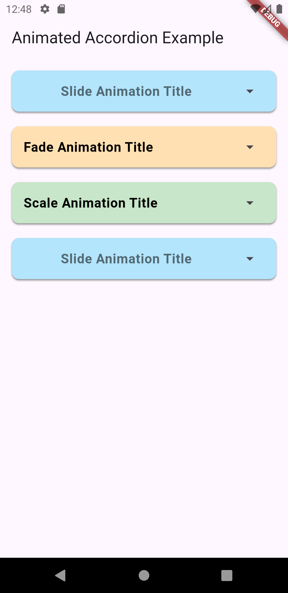

# animated_accordion

The `animated_accordion` package provides an expandable, animated accordion with customizable options such as animation type (fade, scale, slide), header configuration, and more. It allows users to create sleek, responsive, and animated accordions that can be used to display collapsible content.

## Features

- **Custom Animations**: Choose from fade, scale, or slide animations.
- **Customizable Header**: Add icons, titles, or any widget to the header.
- **Dynamic Content**: Easily insert lists, widgets, or buttons within the content.
- **Expandable/Collapsible**: Each accordion section can be toggled open or closed, with the option to maintain state.
- **Custom Styling**: Modify the appearance of the header and content with various background colors, shapes, padding, and elevations.

## Demo

### Video Demo

[](Click Here To Watch Demo!)

### Image Examples

| Image Example        |
|---------------------------------|
| [](example_image.png) | 

## Usage

To use this package, add `animated_accordion` as a dependency in your `pubspec.yaml`:

```yaml
dependencies:
  animated_accordion: ^1.0.0
```

### Example

Here's a basic example showing how to use `animated_accordion` in your project with different animation types:

```dart
import 'package:animated_accordion/animated_accordion.dart';
import 'package:flutter/material.dart';

void main() {
  runApp(const MyApp());
}

class MyApp extends StatelessWidget {
  const MyApp({super.key});

  @override
  Widget build(BuildContext context) {
    return MaterialApp(
      home: Scaffold(
        appBar: AppBar(
          title: const Text('Expandable Tile Example'),
        ),
        body: const Padding(
          padding: EdgeInsets.all(16.0),
          child: ExampleScreen(),
        ),
      ),
    );
  }
}

class ExampleScreen extends StatelessWidget {
  const ExampleScreen({super.key});

  @override
  Widget build(BuildContext context) {
    return ListView(
      children: [
        AnimatedAccordion(
          headerTitle: "Slide Animation Title",
          contentWidgets: [
            const ListTile(
              title: Text("Content 1"),
            ),
            const ListTile(
              title: Text("Content 2"),
            ),
            const ListTile(
              title: Text("Content 3"),
            ),
            ElevatedButton(
                onPressed: () {
                  print("Button in Slide");
                },
                child: const Text("Button in Slide")),
          ],
          contentAnimationType: AnimatedAccordionAnimationType.slide,
          headerBackgroundColor: Colors.lightBlue[100],
          contentBackgroundColor: Colors.lightBlue[200],
          headerTitleStyle: const TextStyle(
            fontSize: 18,
            fontWeight: FontWeight.bold,
          ),
          contentHeight: 150,
          animationDuration: const Duration(milliseconds: 700),
        ),
        AnimatedAccordion(
          headerTitle: "Fade Animation Title",
          contentWidgets: [
            const ListTile(
              title: Text("Fade Content 1"),
            ),
            const ListTile(
              title: Text("Fade Content 2"),
            ),
            const ListTile(
              title: Text("Fade Content 3"),
            ),
          ],
          contentAnimationType: AnimatedAccordionAnimationType.fade,
          headerBackgroundColor: Colors.orange[100],
          contentBackgroundColor: Colors.orange[200],
        ),
        AnimatedAccordion(
          headerTitle: "Scale Animation Title",
          contentWidgets: [
            const ListTile(
              title: Text("Scale Content 1"),
            ),
            const ListTile(
              title: Text("Scale Content 2"),
            ),
            const ListTile(
              title: Text("Scale Content 3"),
            ),
          ],
          contentAnimationType: AnimatedAccordionAnimationType.scale,
          headerBackgroundColor: Colors.green[100],
          contentBackgroundColor: Colors.green[200],
        ),
      ],
    );
  }
}
```

### Parameters

- **`headerTitle`**: The title text that appears in the header.
- **`contentWidgets`**: A list of widgets that will be displayed when the accordion is expanded.
- **`contentAnimationType`**: The type of animation to use when expanding or collapsing the accordion (`fade`, `scale`, `slide`).
- **`contentHeight`**: The height of the expanded content area.
- **`headerBackgroundColor`**: The background color for the header section.
- **`headerTextColor`**: The text color for the header title.
- **`tileBackgroundColor`**: The background color of the accordion tile (header + content).
- **`animationDuration`**: Duration of the animation for expanding/collapsing.
- **`onExpansionChanged`**: A callback function triggered when the expansion state changes.
- **`collapsedTileElevation`**: The shadow elevation when the tile is collapsed.
- **`expandedTileElevation`**: The shadow elevation when the tile is expanded.
- **`headerShape`**: Shape of the header section.
- **`contentShape`**: Shape of the content section.
- **`headerTextAlign`**: Alignment of the header title (e.g., `TextAlign.start`, `TextAlign.center`).

### License

This package is released under the MIT License. See [LICENSE](LICENSE) for details.

